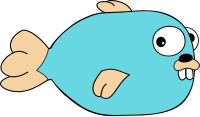
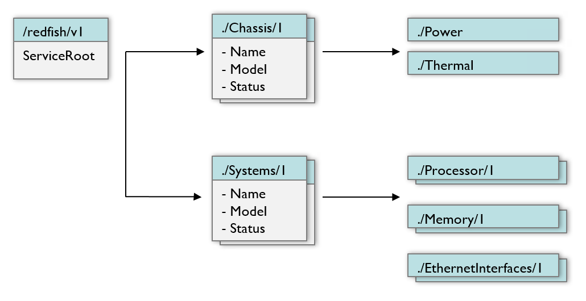
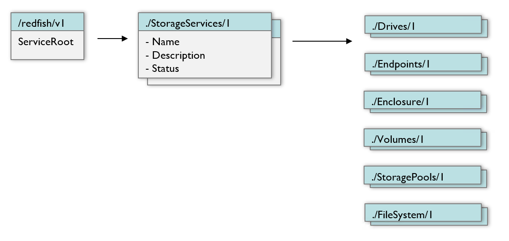
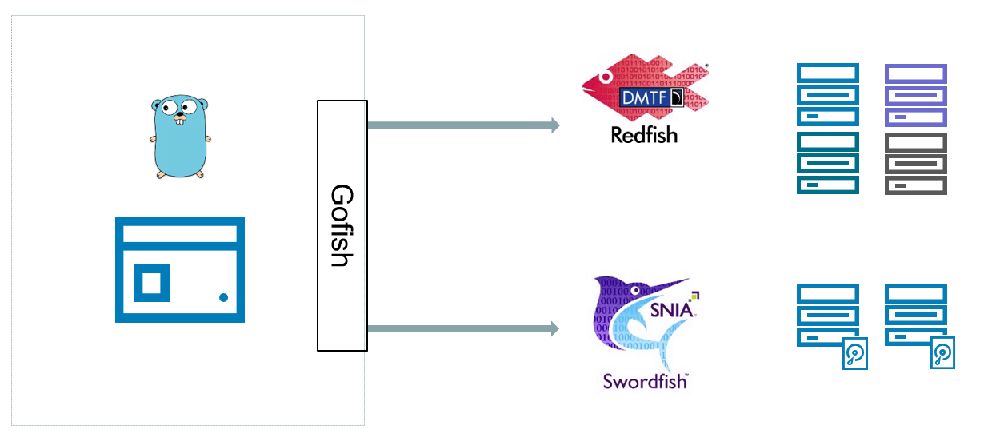
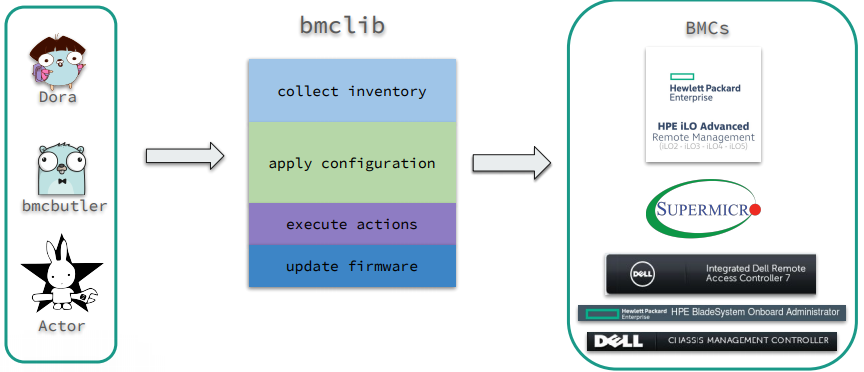

# Gofish

<small>A Go library for Redfish and Swordfish</small>

 <!-- .element: style="background:none; border:none; box-shadow:none;" -->

---

### What is Go

* Statically typed language from Google
* Fast, efficient, and portable
  * Native concurrency
  * Target different platforms at compile time

 <!-- .element: style="background:none; border:none; box-shadow:none;" -->

---

### Baseboard Management Controller

A BMC is a **system on a chip** that integrates various computer components in
a single die/package, roughly similar to the Broadcom SoC found on a Raspberry
Pi, except the BMC runs within a server/chassis/switch/JBOD/JBOF with its own
OS/Firmware.

---

### Asset Lifecycle Management

* Out of band access to servers/switches/JBODS, etc
* Last resort to power cycle, reboot, hard reset
* IPMI/VNC/iKVM/Serial console access
* Inventory information
* Hardware logs
* Root of trust

---

### Redfish Overview

* Built off of capabilities of IPMI, SMASH, etc.
* Uses modern, interoperable technologies
  * REST (HTTP)
  * JSON data representation
  * Clearly defined object schema

---

### Swordfish Overview

* Built on top of Redfish specification
* Adds objects for storage management
* Close collaboration with the DMTF Redfish team

---

## Object Model

---

### Redfish Objects



---

### Swordfish Objects



---

## Gofish Overview

---

### High Level View



---

### Features

* Hides internal details from consumers
* Presents basic object model
* Attempts to handle implementation specific differences so users don't need to

---

## Example Usage

---

### Reboot Example

```go
package main

import (
	"fmt"

	"github.com/stmcginnis/gofish"
	"github.com/stmcginnis/gofish/redfish"
)
```

---

### Reboot Example

```go
func main() {
	// Create a new instance of gofish client, ignoring
	// self-signed certs
	config := gofish.ClientConfig{
		Endpoint: "https://bmc-ip",
		Username: "my-username",
		Password: "my-password",
		Insecure: true,
	}
```

---

### Reboot Example

```go
	c, err := gofish.Connect(config)
	if err != nil {
		panic(err)
	}
	defer c.Logout()
```

---

### Reboot Example

```go
	// Get the service root
	service := c.Service
```

---

### Reboot Example

```go
	// Query the computer systems
	ss, err := service.Systems()
	if err != nil {
		panic(err)
	}
```

---

### Reboot Example

```go
// Creates a boot override to pxe once
bootOverride := redfish.Boot{
	BootSourceOverrideTarget:  redfish.PxeBootSourceOverrideTarget,
	BootSourceOverrideEnabled: redfish.OnceBootSourceOverrideEnabled,
}
```

---

### Reboot Example

```go
	for _, system := range ss {
		fmt.Printf("System: %#v\n\n", system)
		err := system.SetBoot(bootOverride)
		if err != nil {
			panic(err)
		}
		err = system.Reset(redfish.ForceRestartResetType)
		if err != nil {
			panic(err)
		}
	}
```

---

### bmclib

#### A Baseboard Managment Controller library

 <!-- .element: style="background:none; border:none; box-shadow:none;" -->

---

### Challenges

* Treat servers as light bulbs - **plug and play**
* Reliably **provision**
* Accurately **inventory**
* Manage BMC **configuration**
* **Diagnose** hardware problems

All done using the BMC, **without** manual intervention, at **scale**.

---

### bmclib

#### One library to abstract BMC interaction

---

### bmc-toolbox



---

### Ongoing Effort

* Each vendor has had their own protocol <!-- .element: class="fragment fade-in-then-semi-out" -->
* Vendor support for Redfish is growing <!-- .element: class="fragment fade-in-then-semi-out" -->
* Easier to use one common protocol <!-- .element: class="fragment fade-in-then-semi-out" -->
* More work to be done, but heading in the right direction <!-- .element: class="fragment fade-in-then-semi-out" -->

---

* Try it out!
* Report any issues via GitHub
* Submit pull requests for updates and fixes

---

### Links and References

[https://github.com/stmcginnis/gofish](https://github.com/stmcginnis/gofish)

[https://redfish.dmtf.org](https://redfish.dmtf.org)

[https://www.snia.org/forums/smi/swordfish](https://www.snia.org/forums/smi/swordfish)

[https://github.com/bmc-toolbox/bmclib](https://github.com/bmc-toolbox/bmclib)

---

## Thanks!

[@SeanTMcGinnis](https://twitter.com/SeanTMcGinnis) <!-- .element: class="footer-link" -->
