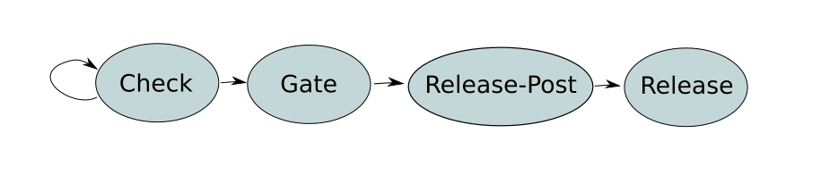

## Release Steps

* Compile/Test/Validate Source Code <!-- .element: class="fragment" -->
* Tag Repo(s) <!-- .element: class="fragment" -->
* Capture/Create Build Artifacts <!-- .element: class="fragment" -->
* Publish Artifacts and Documentation <!-- .element: class="fragment" -->
* Send Release Announcements <!-- .element: class="fragment" -->

---

## Automate All The Things!

---

## Early OpenStack Automation Attempt

Trigger jobs to run on new git tag.

---

### Issues

* Inconsistent use of SemVer <!-- .element: class="fragment fade-in-then-semi-out" -->
* Inconsistent publishing of released packages <!-- .element: class="fragment fade-in-then-semi-out" -->
* Tagging incorrect commits <!-- .element: class="fragment fade-in-then-semi-out" -->
* Missing stable branches for stable code <!-- .element: class="fragment fade-in-then-semi-out" -->
* Manual process to publish release information <!-- .element: class="fragment fade-in-then-semi-out" -->

---

## Automate More Things!

---

## Code Review All The Things!

---

### Gerrit Code Review

<div class="container">
<div class="col">

* Easy code review
* Access control by repo
* Extensible plugins

</div>
<div class="col">
</img>
</div>
</div>

---

### Zuul CI Gating

<div class="container">
<div class="col">

* Cross-project and scalable
* Ansible-based

</div>
<div class="col">
</img>
</div>
</div>

---

### OpenStack Workflow


* Submit changes to Gerrit for code review
* CI used to check and vote on code
* On approval, CI performs final gate checks
* Code is merged to master branch by Gerrit

---

### Release Process Overview

1. Team submits review updating *$deliverable.yaml* file
  * New release tag
  * New branch creation
2. Release team reviews request
  * Check that validation jobs pass
  * Check semver rules are followed
3. Zuul jobs perform tagging, upload to pypi, publish tarballs

[https://releases.openstack.org/reference/using.html](https://releases.openstack.org/reference/using.html) <!-- .element: class="footer-link" -->

---

### Release Request

```yaml
launchpad: spam
team: 'Flying Circus'
type: library
release-model: cycle-with-intermediary
repository-settings:
  openstack/spam:
    tarball-base: openstack-spam
releases:
  - projects:
      - hash: 3da9679d9b12e2808ce9d073117e93d40ce05da3
        repo: openstack/spam
    version: 1.1.0
branches:
  - location: 1.1.0
    name: stable/rocky
```

---

### Release Request - Team Info

```yaml
launchpad: spam
team: 'Flying Circus'
```

---

### Release Request - Deliverable Info

```yaml
type: library
release-model: cycle-with-intermediary
```

---

### Release Request - Repo Settings

```yaml
repository-settings:
  openstack/spam:
    tarball-base: openstack-spam
```

---

### Release Request - Releases

```yaml
releases:
  - projects:
      - hash: 3da9679d9b12e2808ce9d073117e93d40ce05da3
        repo: openstack/spam
    version: 1.1.0
```

---

### Release Request - Branching

```yaml
branches:
  - location: 1.1.0
    name: stable/rocky
```

---

### Release Request - New-Release Command

```bash
$ new-release SERIES DELIVERABLE TYPE
```

___

<dl>
<dt>SERIES</dt>
<dd>which release cycle to release from</dd>
<dt>DELIVERABLE</dt>
<dd>the name of the deliverable to be released</dd>
<dt>TYPE</dt>
<dd>the scope of included changes for SemVer</dd>
</dl>

---

### Release Request - New-Release Command

```bash
$ new-release train cinder feature
```

```yaml
releases:
  - projects:
      - hash: eda9679d9b12e2808ce9d073117e93d40ce05da3
        repo: openstack/cinder
    version: 1.1.0
  - projects:
      - hash: a9ee679d9112e2808ce9d07d117e93d40ce05da3
        repo: openstack/cinder
    version: 1.2.0
```

---

### Release Review


---

### Release Review


---

### Zuul Pipelines



* Check - basic validation
* Gate - final validation
* Release-Post - release processing
* Release - Final release tag actions

---

### Check and Gate Pipelines

* Build Docs
* Validation Checks
* List Changes (check only)

---

### Release-Post Pipeline

* Publish Docs
* Tag Release

---

### Release Pipeline

* Propose Requirements Patches
* Project-Specific Release (PyPi, PuppetForge, etc.)
* Send Release Announcement

---

### Release Requests

<div class="container">
<div class="col">
</img>
</div>
<div class="col">

* Build Docs
* Validation Checks
* List Changes

</div>
</div>

---

### Check and Gate - Build Docs

* Release information is published on website
* Uses RST/Sphinx to generate site from text files
* Sphinx extensions read YAML files to pull in data

<br><br>
CI job builds docs to ensure no errors with the information in the files.

---

### Check and Gate - Validation Checks

* Ensure deliverable metadata is consistent
* Commit hash exists in repo
* Stable release points to commit on stable branch
* Sdist for Python can be built
* No README errors for PyPi upload
* Permissions set to upload to PyPi
* Version number is valid

[https://opendev.org/openstack/releases/src/branch/master/openstack_releases/cmds/validate.py](https://opendev.org/openstack/releases/src/branch/master/openstack_releases/cmds/validate.py) <!-- .element: class="footer-link" -->

---

### Check - List Changes

* List all commits included in this release
* List any dependency requirements changes
* Print Project Team Lead and Release Liaison
* Generate example release announcement text

[https://opendev.org/openstack/releases/src/branch/master/openstack_releases/cmds/list-changes.py](https://opendev.org/openstack/releases/src/branch/master/openstack_releases/cmds/list-changes.py) <!-- .element: class="footer-link" -->

---

### Post-Release Queue - Approved Release Request

* Publish Docs
* Tag Release

---

### Approved Release - Publish Docs

* In-repo docs built using Sphinx and data files
* Doc build output pushed to releases.openstack.org

---

#### Published Release Info


---

### Approved Release - Release Tagging

* Extract details from release commit <!-- .element: class="fragment fade-in-then-semi-out" -->
* Include release patch metadata in tag <!-- .element: class="fragment fade-in-then-semi-out" -->
* Update all bug reports to indicate what release includes fix <!-- .element: class="fragment fade-in-then-semi-out" -->
* Create branch if needed <!-- .element: class="fragment fade-in-then-semi-out" -->

---

### Release Queue - Post Repo Tagging

* Propose Requirements Patches
* Project-Specific Release (PyPi, PuppetForge, etc.)
* Send Release Announcement

---

### Update Requirements

* Cross-project requirements track tested versions
* New versions of dependencies are proposed and tested

---

### Project-Specific Release

* Publish tarballs and signatures
* Package and publish based on project type and needs
  * Python packages on PyPi
  * NodeJS publish to npm
  * Puppet modules to PuppetForge

---

### Send Release Announcements

* Send email to mailing list
* Send message to Slack, IRC, etc.

---

### Overall Ideas

* Automate repetitive tasks <!-- .element: class="fragment fade-in-then-semi-out" -->
* Automate security tasks <!-- .element: class="fragment fade-in-then-semi-out" -->
* Automate as much of manual tasks as possible <!-- .element: class="fragment fade-in-then-semi-out" -->
* Keep looking for issues to catch that will break automation <!-- .element: class="fragment fade-in-then-semi-out" -->
* Leverage git and development workflow <!-- .element: class="fragment fade-in-then-semi-out" -->

---

## Thanks!

[@SeanTMcGinnis](https://twitter.com/SeanTMcGinnis) <!-- .element: class="footer-link" -->
