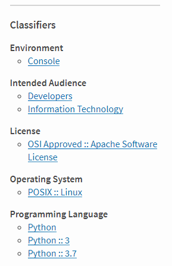

### Consuming Published Packages

```bash
python3 -m pip install mysupercoolpackage
```

Note:
Publishing your package to PyPi allows users of your library to easily
install it with pip.

---

### Python Package Index

 <!-- .element: style="background:none; border:none; box-shadow:none;" -->

<small>https://pypi.org</small>

Note:
Packages can be published to PyPi for anyone to be able to find and access them.

---

### Requirements

* Prepare source code for publishing
* Register on PyPi.org (and test.pypi.org)
* Generate archives
* Upload your package to PyPi

---

### Prerequisites

```bash
python3 -m pip install --user setuptools twine wheel
```

---

### Prepare source code

Prepare necessary files:

* README.md or README.rst
* LICENSE file
* setup.py (and optionally setup.cfg)

Note:

A few files need to be in place to properly package things. Setuptools and/or PyPi will expect
these files to be present.

---

### README

```rst
My Cool Package
===============

Isn't this special?!
```

---

### LICENSE

```text
                                 Apache License
                           Version 2.0, January 2004
                        http://www.apache.org/licenses/

   TERMS AND CONDITIONS FOR USE, REPRODUCTION, AND DISTRIBUTION

   1. Definitions.
   ...
```

---

### setup.py

```python
import setuptools

with open("README.md", "r") as fh:
    long_description = fh.read()

setuptools.setup(
    name="example-pkg-YOUR-USERNAME-HERE", # Replace with your own username
    version="0.0.1",
    author="Example Author",
    author_email="author@example.com",
    description="A small example package",
    long_description=long_description,
    long_description_content_type="text/markdown",
    url="https://github.com/pypa/sampleproject",
    packages=setuptools.find_packages(),
    classifiers=[
        "Programming Language :: Python :: 3",
        "License :: OSI Approved :: MIT License",
        "Operating System :: OS Independent",
    ],
    python_requires='>=3.6',
)
```

---

### Pacakage Metadata

**PEP 426**

Metadata for Python Software Packages 2.0

[https://www.python.org/dev/peps/pep-0426/](https://www.python.org/dev/peps/pep-0426/)

---

### PBR

Python Build Reasonableness

PBR is a library that injects some useful and sensible default behaviors into your setuptools run.

---

### PBR Versioning

```python
import setuptools

setuptools.setup(
    version="0.1.0",
)
```

---

### PBR Versioning

```python
import setuptools

setuptools.setup(
    setup_requires=['pbr'],
    pbr=True)
```

---

### PBR Versioning

```bash
$ git tag -a 0.1.0 -m "Version 0.1.0"

$ python3 setup.py --version
0.1.0
```

---

### setup.cfg

```ini
[metadata]
name = sparkler
summary = GitHub stats sparkline CLI
description-file =
    README.rst
author = Sean McGinnis
author-email = sean.mcginnis@gmail.com
home-page = http://www.ivehearditbothways.com
license = Apache License 2.0
keywords = sparklines spark lines
classifier =
    Environment :: Console
    Intended Audience :: Information Technology
    Intended Audience :: Developers
    License :: OSI Approved :: Apache Software License
    Operating System :: POSIX :: Linux
    Programming Language :: Python
    Programming Language :: Python :: 3
    Programming Language :: Python :: 3.7
```

---

 <!-- .element: style="background:none; border:none; box-shadow:none;" -->

---

 <!-- .element: style="background:none; border:none; box-shadow:none;" -->

---

### Register on PyPi

[https://test.pypi.org/account/register/](https://test.pypi.org/account/register/)
[https://pypi.org/account/register/](https://pypi.org/account/register/)

---

### Generate Archives

```python
python3 setup.py sdist bdist_wheel
```

```bash
dist/
├ superawesomeproject-0.1.0.tar.gz
└ superawesomeproject-0.1.0-py3-none-any.whl
```

---

### Upload to PyPi

```bash
python3 -m twine upload --repository-url \
    https://test.pypi.org/legacy/ dist/*
```

```bash
Uploading distributions to https://test.pypi.org/legacy/
Enter your username: [your username]
Enter your password:
```

---

### Upload to PyPi

```bash
python3 -m pip install --index-url \
    https://test.pypi.org/simple/ --no-deps superawesomepackage
```

```bash
python3 -m twine upload superawesomepackage
```

---

### Note on README.rst

Validate correct RST formatting before upload!


```bash
python3 -m twine check dist/*
```

---

## References

Official Documentation

[https://pypi.org/help/](https://pypi.org/help/)

---

## Thanks!

[@SeanTMcGinnis](https://twitter.com/SeanTMcGinnis) <!-- .element: class="footer-link" -->
